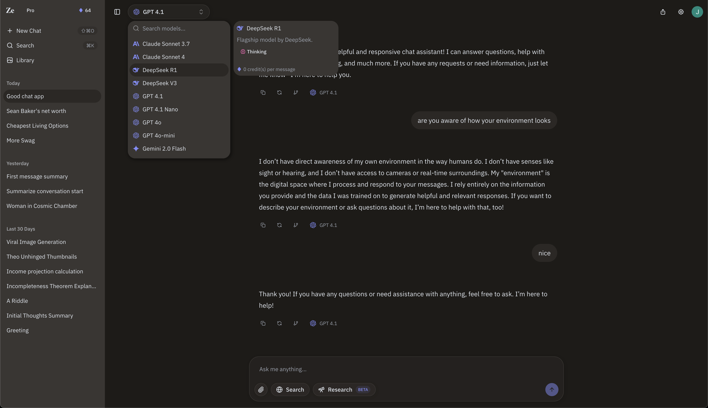

<div align="center">
  <a href="https://github.com/wingleeio/chat-zeron">
    
  </a>

  <h3 align="center">Zeron Chat</h3>

  <p align="center">
    A unified AI chat app with models from Claude, OpenAI, Gemini, and more.
    <br />
    <a href="https://github.com/wingleeio/chat-zeron/issues">Report Bug</a>
    ·
    <a href="https://github.com/wingleeio/chat-zeron/issues">Request Feature</a>
  </p>
</div>

[](https://github.com/wingleeio/chat-zeron/blob/main/LICENSE)

---

## About The Project

Zeron Chat is a sleek, modern, and unified AI chat application. It allows you to interact with large language models from Anthropic (Claude), OpenAI (GPT), and Google (Gemini) all in one place. This project was created for the T3 Chat Cloneathon.

<div align="center">
  
</div>

## Key Features

- **Resumable Streams**: Continue generating responses even after a page refresh.
- **Fast Navigation**: Quickly switch between different chat sessions.
- **Search Tool**: Integrated search functionality. Using [Exa](https://www.exa.ai/)
- **Research Tool**: Perform research within the chat interface.
- **Image Generation**: Create images with AI. Using [Together AI](https://together.ai/)
- **Image Uploads**: Upload and use images in your conversations.
- **Chat Branching**: Explore different conversation paths.
- **Chat Sharing**: Share your conversations with others.
- **Theming**: Multiple themes to customize the look and feel.

## Built With

This project is built with:

- [TanStack Start](https://tanstack.com/start/latest)
- [Convex](https://www.convex.dev/)
- [Vercel AI SDK](https://sdk.vercel.ai/)
- [React](https://react.dev/)
- [TypeScript](https://www.typescriptlang.org/)
- [Shadcn/UI](https://ui.shadcn.com/)

## Getting Started

To get a local copy up and running, follow these simple steps.

### Prerequisites

You need to have `pnpm` installed.

### Installation

1.  Clone the repo
    ```sh
    git clone https://github.com/wingleeio/chat-zeron.git
    ```
2.  Install PNPM packages
    ```sh
    pnpm install
    ```
3.  Start the development server
    ```sh
    pnpm dev
    ```
4.  Run convex locally
    ```sh
    npx convex dev
    ```

Note: Ensure environment variables setup in `env.client` and `env.server` are provided. `env.server` variables must be defined within [Convex](https://www.convex.dev/).

## License

Distributed under the MIT License. See `LICENSE` for more information.

<!--

Development Notes

Some of the goals I wanted to achieve while building this are:

- Resumable streaming (streams continue on refresh)
- Server side rendering

This turned out to be a challenging task while using the `persistent-text-streaming` component for Convex. I solved this by identifying
which messages are currently being streamed and which messages can be rendered server side. This created more problems regarding the state
of components within my `UIMessage` component which I have temporarily solved by using `tanstack-store` which I would like to organize more
when I revisit certain elements like `ReasoningPart`.

I also attempted to use the `Agent` component from Convex however there seems to be no server side rendering support currently, making it
challenging to accomplish what I am hoping to accomplish with this application.

### Jun 14, 2025 Notes

Yesterday worked on features like branching, chat sharing, etc.

Also deployed the application to vercel. I am a bit disappointed in the routing performance. Struggling to stop myself from converting the
entire application to be client side rendered as opposed to SSR. I am likely doing something incorrectly, and I will debug this further today.

My goal today is to implement image uploads and image generation. If time allows I would like to play around with potentially creating a deep
research tool today as well.

### Jun 15, 2025 Notes

Yesterday got a lot of bugs fixed and finished image uploads. Waiting to see if I can get access to 4o ImageGen on Azure before implementing the image generation tool.

Today I built out a lot of the setting UI, ultimately decided against BYOK for now as I do not want to encrypt users keys.

I really enjoy using Convex so far, it's a great experience.

### Jun 18, 2025 Notes

Ended up removing the Clerk authentication check on the backend as that was slowing down the site significantly. Unfortunately this means we can't load data on the server
side, but now that I think about it more, it's not necessary for an application like this. We can still provide og metadata for public chats, so overall it's
not much of a loss and performance in routing between chats has improved drastically.

The past few days we have added image generation tool, search tool, research tool, themes, subscriptions, and user preferences. -->
